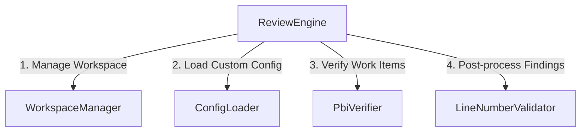

# ⚙️ ReviewEngine Refactor & Breakdown Implementation Plan

This plan details how to refactor and break down `src/review/engine.ts` (currently ~1,629 lines) into smaller, single-responsibility modules. This will improve maintainability, simplify unit testing, and clarify the orchestrator's design.

---

## 🎯 Goals

1. **Single Responsibility**: Reduce the scope of [ReviewEngine](file:///root/merge-mentor/src/review/engine.ts) to pure high-level orchestration of the review phases.
2. **Readability**: Bring the line count of [engine.ts](file:///root/merge-mentor/src/review/engine.ts) from ~1,629 lines down to under 700 lines.
3. **Decomposition**: Extract git repository workspace operations, configuration parsing, PBI verification, and finding/line validations into self-contained, easily testable classes/helpers.
4. **Decoupled Testing**: Enable testing of each sub-system independently (e.g., workspace management, config loading, work item alignment) without mocking the entire `ReviewEngine` context.

---

## 🏗️ Proposed Architecture

The orchestrator will delegate to four main specialized sub-systems:



---

## 🛠️ Step-by-Step Breakdown Plan

### Step 1: Extract Workspace Management (`src/review/workspaceManager.ts`)

Currently, [ReviewEngine](file:///root/merge-mentor/src/review/engine.ts) directly handles path checking, branch-to-directory mapping, and repo cloning logic.

- **New Class**: `WorkspaceManager`
- **Responsibilities**:
  - Check and retrieve the base workspace path (local vs. remote clone).
  - Wrap around `RepoManager` and orchestrate the cloning / branch checkout process.
  - Handle copying temporary diff files into the checked-out workspace directory under `.mergementor/`.
- **Methods to Move**:
  - `resolveWorkspace` -> `WorkspaceManager.resolveWorkspace`
  - `ensureRepoCloned` -> `WorkspaceManager.ensureRepoCloned`
  - `copyDiffsToRepoDir` -> `WorkspaceManager.copyDiffsToRepoDir`

```typescript
export class WorkspaceManager {
  constructor(
    private readonly platform: PlatformAdapter,
    private readonly repoManager: RepoManager,
    private readonly fileSystem: FileSystem,
    private readonly options: {
      localWorkspacePath?: string;
      tempPath?: string;
      verbose?: boolean;
    },
    private readonly output: OutputWriter,
    private readonly logger: ReturnType<typeof createChildLogger>
  ) {}

  public async resolveWorkspace(branch: string): Promise<string> { ... }
  public async ensureRepoCloned(branch: string): Promise<string> { ... }
  public async copyDiffsToRepoDir(diffDir: string, manifest: DiffManifest, repoPath?: string): Promise<{ paths: string[]; totalSize: number }> { ... }
}
```

---

### Step 2: Extract Project Configuration Loader (`src/review/configLoader.ts`)

Loading custom project configuration (`.mergementor.json`) uses Zod schema validation and local file reads. This can be decoupled completely.

- **New Helper/Class**: `ConfigLoader`
- **Responsibilities**:
  - Locate, access, and parse `.mergementor.json` at the root of the resolved workspace.
  - Perform strict schema validation via Zod and output normalized `TestMapperOptions`.
- **Methods to Move**:
  - `loadProjectConfig` -> `ConfigLoader.loadProjectConfig`
  - Move `ProjectConfigSchema` validation rules out of [engine.ts](file:///root/merge-mentor/src/review/engine.ts).

---

### Step 3: Extract PBI / Work Item Alignment Verification (`src/review/pbiVerifier.ts`)

PBI-to-PR alignment checking fetches linked items, invokes the AI prompt, parses response schemas, and formats Markdown summaries. This is highly self-contained.

- **New Class**: `PbiVerifier`
- **Responsibilities**:
  - Query PlatformAdapter for linked work items / issues.
  - Fetch individual work item details (including Task parent tree traversal).
  - Build PBI-to-PR prompts and execute AI provider query.
  - Parse alignment JSON, format the collapsible markdown verification reports.
- **Methods/Logic to Move**:
  - PBI verification orchestration (lines 614-685) -> `PbiVerifier.verifyPRAlignment`

```typescript
export class PbiVerifier {
  constructor(
    private readonly platform: PlatformAdapter,
    private readonly provider: AIProviderClient,
    private readonly logger: ReturnType<typeof createChildLogger>,
    private readonly output: OutputWriter
  ) {}

  public async verifyPRAlignment(
    prNumber: number,
    files: PRFile[],
    onTokenUsage: (usage: TokenUsage | undefined) => void
  ): Promise<string | null> { ... }
}
```

---

### Step 4: Extract Line Number Validation (`src/review/lineNumberValidator.ts`)

Post-processing AI findings to map them to valid Git unified diff lines is pure algorithmic mapping.

- **New Helper/Class**: `LineNumberValidator`
- **Responsibilities**:
  - Build mapping of files to their valid diff lines.
  - Adjust finding line numbers to the nearest valid diff line using existing `diffParser` utilities.
  - Filter out invalid findings and log warnings.
- **Methods to Move**:
  - `validateLineNumbers` -> `LineNumberValidator.validate`

---

## 🧪 Test Coverage & Migration Strategy

Since there are large test suites, we must ensure zero regressions:

1. **Phase 1 Tests**:
   - Create `src/review/workspaceManager.spec.ts` and migrate existing repo-cloning and workspace mapping tests from [engine.spec.ts](file:///root/merge-mentor/src/review/engine.spec.ts) into it.
2. **Phase 2 Tests**:
   - Create `src/review/configLoader.spec.ts` and cover custom config parsing, schema mismatches, and fallback behaviors.
3. **Phase 4 Tests**:
   - Create `src/review/pbiVerifier.spec.ts` and migrate alignment validation, multi-PBI handling, and warning comments.
4. **Integration Tests**:
   - Keep high-level orchestrator tests in [engine.spec.ts](file:///root/merge-mentor/src/review/engine.spec.ts) to verify that all sub-components integrate seamlessly.

---

## ⚡ Verification Protocol

Before declaring the refactor complete, the following checks will be enforced:

```bash
pnpm check # Compiles codebase, lints, and runs tests
```

All 1,400+ unit tests must pass, and Biome lint rules must be 100% satisfied.
