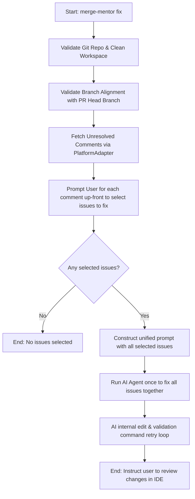

# 🛠️ PR Active Comment Fixer ("Fix" Mode) Implementation Plan

This plan details the design and implementation steps for a new `fix` command in **Merge Mentor**. The command reads active/unresolved review comments from a pull request and allows an AI agent to iteratively modify the code in the local workspace to resolve those issues.

---

## 📋 Architectural Overview

The `fix` command runs locally in an existing Git repository, retrieves unresolved PR review comments from the platform (GitHub or Azure DevOps), checks that the environment is valid and aligned with the PR head branch, and guides the user through an interactive loop to review and apply AI-generated fixes.



---

## 🛠️ Step 1: Platform & Adapter Extensions

We need to add a new method to [PlatformAdapter](file:///root/merge-mentor/src/platforms/types.ts) to retrieve unresolved/active PR comments across both platforms.

### 1. Type Definitions

In [src/platforms/types.ts](file:///root/merge-mentor/src/platforms/types.ts), define the structure for unresolved comment threads:

```typescript
export interface UnresolvedComment {
  readonly author: string;
  readonly body: string;
}

export interface UnresolvedCommentThread {
  readonly id: string | number;
  readonly path: string;
  readonly line: number;
  readonly comments: readonly UnresolvedComment[];
}
```

Add the method signature to `PlatformAdapter`:

```typescript
/**
 * Retrieves all unresolved/active PR comment threads.
 * @param prNumber - The PR number
 */
getUnresolvedCommentThreads(prNumber: number): Promise<UnresolvedCommentThread[]>;
```

### 2. GitHub Implementation

In [src/platforms/github.ts](file:///root/merge-mentor/src/platforms/github.ts), use the **GitHub GraphQL API (v4)** to fetch review comment threads where `isResolved === false`:

```typescript
async getUnresolvedCommentThreads(prNumber: number): Promise<UnresolvedCommentThread[]> {
  const query = `
    query FetchUnresolvedThreads($owner: String!, $repo: String!, $pr: Int!) {
      repository(owner: $owner, name: $repo) {
        pullRequest(number: $pr) {
          reviewThreads(first: 100) {
            nodes {
              id
              isResolved
              path
              line
              comments(first: 50) {
                nodes {
                  author {
                    login
                  }
                  body
                }
              }
            }
          }
        }
      }
    }
  `;

  const response: any = await withRateLimitHandling(() =>
    this.octokit.graphql(query, {
      owner: this.owner,
      repo: this.repo,
      pr: prNumber,
    })
  );

  const threads = response?.repository?.pullRequest?.reviewThreads?.nodes || [];

  return threads
    .filter((t: any) => !t.isResolved && t.path && t.line)
    .map((t: any) => ({
      id: t.id,
      path: t.path,
      line: t.line,
      comments: t.comments?.nodes.map((c: any) => ({
        author: c.author?.login ?? "unknown",
        body: c.body,
      })) ?? [],
    }));
}
```

### 3. Azure DevOps Implementation

In [src/platforms/azure.ts](file:///root/merge-mentor/src/platforms/azure.ts), fetch threads via `getThreads` and filter out those that are resolved or closed (i.e. status is `Fixed` or `Closed`):

```typescript
async getUnresolvedCommentThreads(prNumber: number): Promise<UnresolvedCommentThread[]> {
  const gitApi = await this.connection.getGitApi();
  const threads = await withRateLimitHandling(() =>
    gitApi.getThreads(this.repoName, prNumber, this.project)
  );

  const unresolved: UnresolvedCommentThread[] = [];
  for (const thread of threads || []) {
    // Exclude resolved (Fixed/Closed) threads
    // Status: 1 = Active, 2 = Fixed, 3 = WontFix, 4 = Closed, 5 = ByDesign, 6 = Pending
    const isUnresolved = thread.status !== 2 && thread.status !== 4;
    const path = thread.threadContext?.filePath;
    const line = thread.threadContext?.rightFileStart?.line;

    if (isUnresolved && path && line && thread.comments && thread.comments.length > 0) {
      unresolved.push({
        id: thread.id?.toString() || "",
        path,
        line,
        comments: thread.comments
          .filter(c => !c.isDeleted)
          .map(c => ({
            author: c.author?.uniqueName ?? c.author?.displayName ?? "unknown",
            body: c.content || "",
          })),
      });
    }
  }

  return unresolved;
}
```

---

## 🛠️ Step 2: Pre-Execution Git Verification

To ensure safe execution, the command will validate the local working directory before taking any actions. If the workspace is dirty, the user will be prompted for confirmation in interactive mode, or can override the check using the `--allow-dirty` flag.

```typescript
import { execSync } from "node:child_process";

export async function validateGitWorkspace(
  expectedHeadBranch: string,
  options: { allowDirty?: boolean; interactive?: boolean } = {},
): Promise<void> {
  // 1. Verify we are inside a Git repo
  try {
    execSync("git rev-parse --is-inside-work-tree", { stdio: "ignore" });
  } catch {
    throw new Error(
      "Execution aborted: Current directory is not a valid Git repository.",
    );
  }

  // 2. Verify workspace is clean
  const status = execSync("git status --porcelain", {
    encoding: "utf-8",
  }).trim();
  if (status.length > 0) {
    if (options.allowDirty) {
      console.warn(
        "⚠️ Warning: Local Git workspace has uncommitted changes, but --allow-dirty is set. Proceeding...",
      );
    } else if (options.interactive) {
      const proceed = await promptUser(
        "⚠️ Warning: Local Git workspace has uncommitted changes. Proceed anyway? (y/N) ",
      );
      if (proceed.toLowerCase() !== "y") {
        throw new Error(
          "Execution aborted by user due to uncommitted changes.",
        );
      }
    } else {
      throw new Error(
        "Execution aborted: Local Git workspace has uncommitted changes.\n" +
          "Use --allow-dirty to override, or stash/commit your changes.",
      );
    }
  }

  // 3. Verify checked-out branch matches PR head branch
  const currentBranch = execSync("git branch --show-current", {
    encoding: "utf-8",
  }).trim();
  if (currentBranch !== expectedHeadBranch) {
    throw new Error(
      `Execution aborted: Branch mismatch.\n` +
        `The PR head branch is '${expectedHeadBranch}', but you are currently on '${currentBranch}'.\n` +
        `Please switch to the correct branch: 'git checkout ${expectedHeadBranch}'`,
    );
  }
}
```

---

## 🛠️ Step 3: Interactive Fixing Orchestration

We will implement the orchestration engine in a new file `src/commands/fix.ts`.

### 1. Command Configuration Options

Add options to the Commander setup in `src/program.ts`:

- `--check-command <cmd>`: Shell command to run to validate fixes (e.g. `pnpm check`). Defaults to `pnpm check` if a lockfile exists, or a project-specific check.
- `--max-retries <number>`: Number of iterations the AI can try fixing compile/test errors (default: `3`).
- `--interactive`: Interactive prompts for each comment (default: `true`, can be disabled with `--no-interactive`).
- `--allow-dirty`: Allow execution even if the local workspace has uncommitted changes (default: `false`).

### 2. Orchestration Loop

```typescript
export async function executeFixCommand(
  options: FixOptions,
  deps: ProgramDeps = {},
): Promise<void> {
  const output = deps.output ?? consoleOutputWriter;

  // 1. Resolve PR details and git branch
  const adapter = getPlatformAdapter(options);
  const prDetails = await adapter.getPRDetails(options.pr);

  // 2. Run Pre-Execution Git Checks
  await validateGitWorkspace(prDetails.headBranch, {
    allowDirty: options.allowDirty,
    interactive: options.interactive,
  });

  // 3. Fetch unresolved comments
  const unresolvedThreads = await adapter.getUnresolvedPRThreads(options.pr);
  if (unresolvedThreads.length === 0) {
    output.log("🎉 No active/unresolved review comments found on this PR!");
    return;
  }

  output.log(
    `🔍 Found ${unresolvedThreads.length} unresolved thread(s). Starting fixes...\n`,
  );

  const selectedThreads: typeof unresolvedThreads = [];

  if (options.interactive) {
    output.log("📋 Please select which issues you want to fix:\n");
    for (let i = 0; i < unresolvedThreads.length; i++) {
      const thread = unresolvedThreads[i];
      output.log(
        `💬 [Issue ${i + 1}/${unresolvedThreads.length}] on [${thread.path}:${thread.line}]:`,
      );
      for (const comment of thread.comments) {
        output.log(`  * ${comment.author}: ${comment.body}`);
      }
      const answer = await promptUser(
        "Do you want to fix this issue? (y/n/q) ",
      );
      if (answer.toLowerCase() === "q") {
        output.log(
          "👋 Exiting selection. Proceeding with currently selected issues.",
        );
        break;
      }
      if (answer.toLowerCase() === "y") {
        selectedThreads.push(thread);
      }
    }
  } else {
    selectedThreads.push(...unresolvedThreads);
  }

  if (selectedThreads.length === 0) {
    output.log("⏭️ No issues selected for fixing.");
    return;
  }

  output.log(
    `🤖 Running AI agent to resolve the ${selectedThreads.length} selected issue(s)...`,
  );

  // Construct batch prompt and execute AI agent once
  const prompt = constructBatchPrompt(selectedThreads);
  await aiClient.executePrompt(prompt);

  output.log(
    "\n✅ AI execution completed. Please review the changes in your IDE.",
  );
}
```

---

## 🛠️ Step 4: AI Agent / Iterative Editing Loop

The AI agent will be executed in a multi-turn repair loop. If the chosen provider is `claude-agent-sdk`, we will construct a prompt and configure the agent with **read and write tools** to edit files directly.

### 1. Enabling Read/Write Tools in the Agent

Modify the Claude SDK options during the fix execution so that the agent has access to file-modifying tools:

```typescript
const agentOptions = {
  tools: ["Read", "Glob", "Grep", "Write", "Edit"], // Added Write and Edit tools
  allowedTools: ["Read", "Glob", "Grep", "Write", "Edit"],
  permissionMode: "dontAsk", // Non-interactive mode for agent tool execution
  cwd: workspacePath,
};
```

### 2. The AI Prompt

The prompt fed to the agent instructs it to find the specific code referenced, perform edits to resolve the comments, and run verification.

```
You are an expert AI code repair assistant.
You are tasked with fixing an issue raised by code review comments.

FILE TO EDIT: {filePath}
LINE NUMBER: {lineNumber}

REVIEW DISCUSSION:
{commentThreads}

INSTRUCTIONS:
1. Locate the file {filePath} around line {lineNumber}.
2. Read the surrounding file content to understand the context.
3. Edit the file to fix the issue described in the review discussion.
4. Do not make any unrelated modifications.
```

### 3. Verification Loop

The parent CLI coordinator (outside the LLM) will handle checking correctness to keep the AI focused:

1. The AI Agent runs and performs code edits.
2. The orchestrator runs the validation command: `npm run check` / `pnpm check`.
3. If it passes: The fix is considered ready.
4. If it fails:
   - Collect the command error logs.
   - Run the AI Agent again, sending a message:
     ```
     Validation command failed with the following error:
     ---
     {validationErrorLogs}
     ---
     Please repair the file to fix these errors.
     ```
   - Increment the retry counter. Loop until clean compile or `maxRetries` reached.

---

## 🧪 Step 5: Test Coverage Plan

We will add the following tests to verify behavior and avoid regressions:

1. **Workspace Validation Tests (`src/commands/fix.spec.ts`)**:
   - Mock `execSync` output for clean workspace, dirty workspace, branch mismatch, and non-git directories. Verify proper error messages and command aborts.
2. **Platform Integration Tests**:
   - Mock GraphQL query results for GitHub review threads to verify correct parsing of unresolved threads.
   - Mock threads from Azure DevOps REST API and verify status filters.
3. **Interactive Prompt Mocks**:
   - Verify prompt selection logic (`y`, `n`, `q`, `a`, `r`, `d`) behaves correctly and reverts files on discard.

---

> [!IMPORTANT]
> **No Automated Commits or Pushes**:
> In accordance with instructions, changes will remain unstaged/uncommitted in the local working directory. The user has full control to run `git add`, `git diff`, and `git commit` after inspecting the changes.
