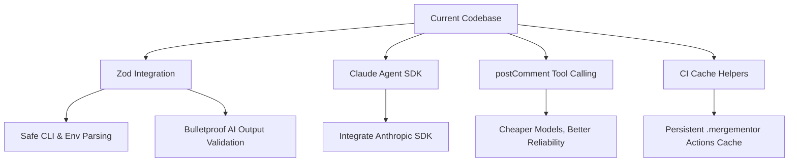

# Project Review & Architectural Audit: Merge Mentor

This document contains a thorough architectural review and audit of the **Merge Mentor** codebase. It highlights the outstanding engineering decisions implemented in the repository, followed by strategic and tactical opportunities for further improvement.

---

## 🌟 What We Are Doing Exceptionally Well

Merge Mentor exhibits standard-setting quality across multiple dimensions. The design is modern, secure, and built with testability and high-throughput reliability in mind.

### 1. Decoupled Ports & Adapters Architecture

The repository's directory layout separates core review orchestrations from environmental side-effects:

- **Ports Abstraction ([src/ports/](file:///D:/GitHub/archerax/merge-mentor/src/ports/))**: All operating system, filesystem, shell, and clock utilities are abstracted behind strict interfaces (e.g., `FileSystem`, `ProcessRunner`, `Clock`, `OutputWriter`).
- **Test Helpers**: Having companion files like [clock.test-helper.ts](file:///D:/GitHub/archerax/merge-mentor/src/ports/clock.test-helper.ts) and [fileSystem.test-helper.ts](file:///D:/GitHub/archerax/merge-mentor/src/ports/fileSystem.test-helper.ts) enables 100% mocked, synchronous test environments. The execution suite never reads or writes to the real filesystem or system clock.
- **Abstract Platform Adapters ([src/platforms/](file:///D:/GitHub/archerax/merge-mentor/src/platforms/))**: Adding support for another version control system (e.g., GitLab or Bitbucket) is as simple as implementing the `PlatformAdapter` interface without modifying the central review logic.

### 2. Industry-Leading Testing Suite

- **High Efficiency & Coverage**: The test suite validates **1,285 tests across 44 suites** in **under 3 seconds** using Vitest.
- **Deterministic Mocks**: The rate-limiting and backoff logic in [rateLimitHandler.spec.ts](file:///D:/GitHub/archerax/merge-mentor/src/utils/rateLimitHandler.spec.ts) and token usage metrics are comprehensively covered via virtual timers, guaranteeing no flaky tests or network dependencies.

### 3. Pioneering Context-Aware Prompt Heuristics

- **Smart Severity Context ([severityContext.ts](file:///D:/GitHub/archerax/merge-mentor/src/ai/prompts/severityContext.ts))**: Instead of treating all files uniformly, the system dynamically analyzes file paths using RegEx to infer domain contexts (e.g., `security-critical`, `financial`, `data-critical`, `test`, `logging`, `admin`).
- **Context-Driven Prompt Injection**: The engine automatically instructs the LLM to apply strict severity assessments (e.g., _Input validation bugs in `/auth/` paths are forced to CRITICAL_) and relaxed assessments (e.g., _Bugs in `/test/` are kept at LOW_). This minimizes false positives.

### 4. Zero-Trust Security Design

- **Ephemeral Git Credentials**: The CLI git client ([cliGitClient.ts](file:///D:/GitHub/archerax/merge-mentor/src/review/gitClients/cliGitClient.ts)) passes OAuth/Azure tokens via inline runtime headers:
  ```bash
  git -c http.https://github.com/.extraHeader="Authorization: Basic <base64>" clone ...
  ```
  This ensures credentials **never leak into the shell history, process tables, or persistent `.git/config` files**.
- **Strict Tool Isolation Allowlists**: In [copilot-sdk.ts](file:///D:/GitHub/archerax/merge-mentor/src/ai/providers/copilot-sdk.ts), the permission handler explicitly blocks risky actions (shell, custom tools, hooks, url requests) while approving only read-only `glob` and `grep` calls, preventing PR contents from triggering arbitrary code execution.

### 5. Multi-Mode UX Flexibility

- **Adaptive Streaming Display**: A custom `StreamingDisplay` ([streamingDisplay.ts](file:///D:/GitHub/archerax/merge-mentor/src/utils/streamingDisplay.ts)) manages smooth, real-time animation of incoming LLM tokens in interactive TTY consoles.
- **CI Graceful Degradation**: It detects headless environments (`ciMode`) and automatically transitions into standard, structured Pino log files (`pino` JSON output).

---

## 🛠️ What We Can Improve

Despite its health, we can introduce modern TypeScript patterns and solve outstanding edge cases to prepare Merge Mentor for scale.



### 1. Migrating to Zod for Structured AI Parsing & CLI Configuration

Currently, validation of inputs and JSON outputs utilizes verbose, manual type guard validation:

```typescript
if (typeof a.file !== "string" || !a.file) {
  return { valid: false, error: "Invalid: 'file' must be a non-empty string" };
}
```

> [!TIP]
> **Action Plan**:
> Integrate `zod` to define declarative schemas for configurations and AI output formats. This removes hundreds of lines of boilerplate and ensures auto-generated TypeScript type inference.

**Example Zod schema for PR comments**:

```typescript
import { z } from "zod";

export const FileFindingSchema = z.object({
  file: z.string().min(1, "File path must be a non-empty string"),
  line: z.number().int().positive("Line number must be a positive integer"),
  body: z.string().min(1, "Comment body is required"),
  severity: z.enum(["critical", "high", "medium", "low"]),
  category: z.enum([
    "bug",
    "security",
    "performance",
    "quality",
    "documentation",
  ]),
  confidence: z.enum(["high", "medium", "low"]).default("high"),
  suggestion: z.string().optional(),
});

export type FileFinding = z.infer<typeof FileFindingSchema>;
```

---

### 2. Implement the Custom `postComment` Tool Call Strategy

Relying solely on LLMs to return well-formed JSON strings is notoriously fragile, especially for cheaper, cost-effective models (e.g., `gpt-4o-mini`, `claude-3.5-haiku`).

> [!IMPORTANT]
> **Action Plan**:
> Proceed with the design outlined in `docs/existing-providers-custom-tool-plan.md`. Registering a `postComment` tool via the Copilot SDK enables the AI to use native tool-calling pathways, which models are specifically trained on.

- **Feedback Loops**: If the AI attempts to call the tool with invalid parameters (e.g., a non-existent file path or negative line number), the tool handler immediately responds to the LLM with the validation error, prompting it to auto-correct.
- **Incremental Extraction**: Findings are compiled in real-time as `tool.execution_complete` events arrive, instead of waiting for the full session response to terminate.

---

### 3. Formalize the `claude-agent-sdk` Integration

The implementation plan drafted in `docs/claude-agent-sdk-plan.md` is complete and ready to execute.

> [!TIP]
> **Action Plan**:
> Proceed with the 11-step implementation order to wire up `"claude-agent-sdk"` as an optional, first-class provider client. This will allow customers to deploy Merge Mentor with Anthropic's agentic search, glob, and grep capabilities.

---

### 4. Provide Native CI/CD Cache Persistence Guides

The engine employs a `ReviewStateCache` (`.mergementor/`) to bypass reviewing files that haven't changed. However, in ephemeral CI pipeline environments (e.g., GitHub Actions, GitLab CI, Azure Pipelines), the temporary folder is completely wiped out between runs.

> [!NOTE]
> **Action Plan**:
> Provide built-in CLI integration guides or script configurations in the `README.md` to instruct users how to cache the `.mergementor` directory in their CI workflows.

**GitHub Actions Caching Example**:

```yaml
- name: Cache Merge Mentor State
  uses: actions/cache@v4
  with:
    path: .mergementor
    key: ${{ runner.os }}-merge-mentor-${{ github.run_id }}
    restore-keys: |
      ${{ runner.os }}-merge-mentor-
```

---

### 5. Advanced Mono-Repo Mapping in `testFileMapper.ts`

The system maps production files to corresponding test files using suffix conventions ([testFileMapper.ts](file:///D:/GitHub/archerax/merge-mentor/src/utils/testFileMapper.ts)):

```typescript
// e.g. src/auth.ts -> src/auth.spec.ts
```

In complex modern mono-repos or standard Java/C# project architectures, test files are often stored in completely separate directory roots (e.g., `/test/src/...` or separate test assemblies).

> [!TIP]
> **Action Plan**:
> Extend `testFileMapper.ts` to support customized glob patterns or map definitions in `.mergementor.json` config files (e.g., `testPaths: ["src/**", "tests/unit/**"]`), allowing companies with complex structures to benefit from production-to-test verification checks.

---

## 📈 Strategic Summary & Next Milestones

We recommend executing improvements in the following priority order:

| Phase       | Milestone                                                                 | Expected Impact                                             | Difficulty |
| ----------- | ------------------------------------------------------------------------- | ----------------------------------------------------------- | ---------- |
| **Phase 1** | Implement **Zod** schema validations for configurations and SDK responses | Deletes boilerplate, guarantees runtime type-safety         | Low        |
| **Phase 2** | Integrate **`postComment` custom tool** for Copilot SDK                   | Safe, cheap structured outputs via GPT-4o-mini              | Medium     |
| **Phase 3** | Implement **Claude Agent SDK Provider**                                   | High-fidelity agentic reasoning support                     | Medium     |
| **Phase 4** | Document **CI Caching recipes** & enhance **Test File Mapper**            | High-performance reviews in complex enterprise repositories | Low        |

This project is exceptionally well-engineered, and these additions will elevate it from a great developer utility to an enterprise-grade automated review framework.
