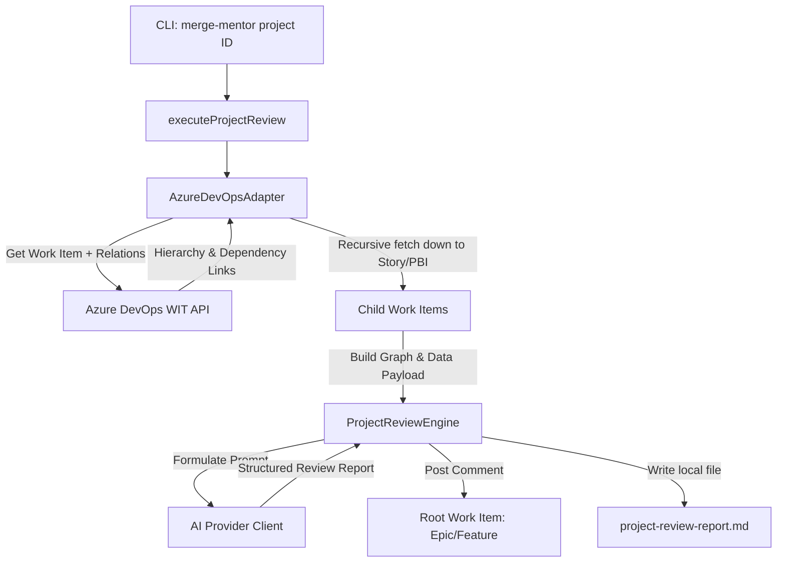

# Feature Design: Hierarchical Project Review (`merge-mentor project`)

This document outlines the architecture, data flows, and changes required to implement project/feature-level planning reviews in Merge Mentor.

## 🚀 Overview

The new `project` command (`merge-mentor project <id>`) traverses a work item hierarchy starting from a root Epic or Feature in Azure DevOps Boards, identifies all descendant PBIs/User Stories (excluding tasks), resolves predecessor/successor dependencies, and runs an AI-powered comprehensive analysis to identify requirement gaps, sequence risks, and estimation anomalies.

---

## 🏗️ Architecture & Data Flow



### 1. Work Item Fetching & Graph Construction

Azure DevOps work items store relations in the `relations` array. We will traverse these relations:

- **Parent/Child Links:** `System.LinkTypes.Hierarchy-Forward` (Children).
- **Dependencies (Predecessors/Successors):**
  - `System.LinkTypes.Dependency-Reverse` (Predecessor: "this item depends on...")
  - `System.LinkTypes.Dependency-Forward` (Successor: "this item blocks...")

#### Algorithmic Flow

1. Fetch root work item (e.g. ID `100`).
2. Add root to a map of retrieved work items.
3. Recursively (or iteratively via a queue) find all child relations (`System.LinkTypes.Hierarchy-Forward`), stopping if a work item is a PBI/User Story (do not fetch child Tasks).
4. Fetch details for each child work item, adding them to the retrieved map.
5. Extract status (`System.State`), description, acceptance criteria, story points/effort, and title for every item in the map.
6. Extract all dependency relations between any items in the map to construct the predecessor/successor graph.

---

## 📝 Analysis Dimensions

The AI prompt will be structured to perform a comprehensive evaluation across four main dimensions:

| Dimension                          | Evaluation Details                                                                                                                                                                      |
| :--------------------------------- | :-------------------------------------------------------------------------------------------------------------------------------------------------------------------------------------- |
| **Plan Completeness & Gaps**       | Checks if the child stories fully cover the scope described in the parent Feature/Epic. Identifies missing requirements or holes.                                                       |
| **Dependency & Sequencing Risks**  | Checks if predecessors are scheduled correctly relative to successors. Highlights items marked _In Progress_ or _Done_ whose blockers are still _To Do_. Detects circular dependencies. |
| **Acceptance Criteria Alignment**  | Verifies that child stories have clear, testable acceptance criteria matching the high-level goals.                                                                                     |
| **Estimation & Scope Consistency** | Flags missing estimates, unusually large stories, or scope creep.                                                                                                                       |

---

## 💻 Proposed CLI Command

```bash
merge-mentor project <id> \
  --platform azure \
  --write \
  --provider copilot-sdk \
  --ai-model gpt-4o
```

### Key Options

- `--platform`: Platform to target (`azure` initially). For GitHub repos, the command will fail gracefully with a clear error: `"GitHub project review is not yet supported in this version."`
- `--write`: Boolean flag to post the consolidated review report back to the root Epic/Feature work item.

---

## 🛠️ Implementation Plan

### Phase 1: Update Platform Adapters (`src/platforms/`)

- Add `getProjectDetails(id: string): Promise<ProjectDetails>` to `PlatformAdapter`.
- Update `AzureDevOpsAdapter` to recursively fetch descendants down to the story/PBI level and resolve dependencies, producing a structured `ProjectDetails` object.
- Stub `GitHubAdapter` (with a clean error or minimal issue list implementation).

### Phase 2: Create Project Review Engine (`src/review/`)

- Implement `ProjectReviewEngine` analogous to `PBIReviewEngine`.
- Construct the system prompt for feature-wide plans.
- Implement structured output validation (Zod schema for Project Review).

### Phase 3: Integrate Commander CLI (`src/program.ts`)

- Add `.command("project <id>")` to the Commander CLI configuration.
- Wire up the environment variable fallback and configuration validation.

### Phase 4: Verification & Testing

- Add unit tests for `ProjectReviewEngine` and `AzureDevOpsAdapter` project features.
- Run `pnpm check` to ensure Type safety, styling, and test compliance.
