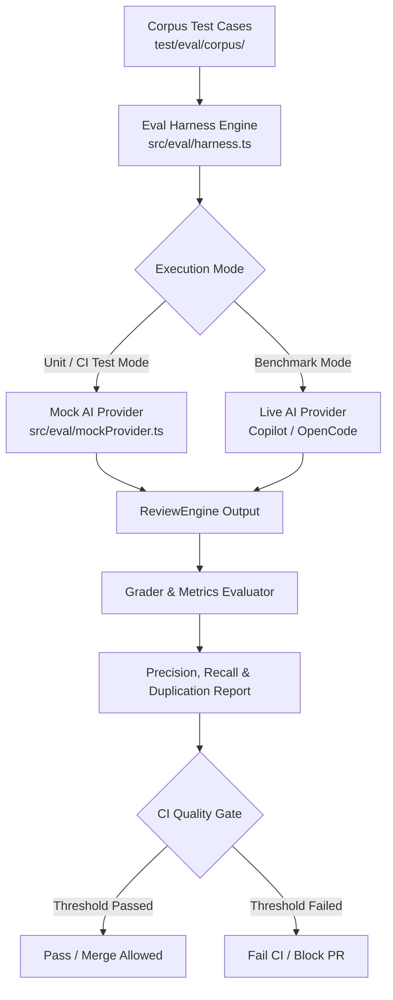

# 🎯 Golden-PR Eval Corpus & Quality Harness Plan

## Overview

As defined in the [Q3 2026 Roadmap](file:///root/merge-mentor/plans/roadmap-q3-2026.md), `merge-mentor` operates under a strict **no-telemetry policy**. To evaluate AI prompt effectiveness, review precision, and deduplication quality without sending data to third-party services, we require an offline benchmark suite: the **Golden-PR Eval Corpus & Harness**.

This document outlines the design, architecture, schemas, and step-by-step implementation for the Golden-PR Eval Corpus and automated quality harness.

---

## High-Level Architecture



---

## Corpus Structure & Schemas

The corpus lives in `test/eval/corpus/` and contains curated, version-controlled PR scenarios with known ground truth expectations.

### Directory Layout

```
test/eval/corpus/
├── 01-sql-injection-auth/
│   ├── PR_MANIFEST.json        # Metadata about the scenario
│   ├── diffs/                  # Diff files (compatible with DiffStorage)
│   │   ├── manifest.json
│   │   └── src__auth__login.ts.diff
│   └── ground-truth.json       # Expected & forbidden findings
├── 02-benign-refactor/         # False-positive reduction scenario
└── 03-reworded-duplicate/      # Line-shift & rewording deduplication scenario
```

### Ground Truth Schema (`test/eval/corpus/*/ground-truth.json`)

```json
{
  "scenarioId": "01-sql-injection-auth",
  "name": "SQL Injection in User Authentication",
  "description": "Tests if critical SQL injection vulnerability is identified and benign logger refactor is ignored.",
  "expectedFindings": [
    {
      "id": "exp-01",
      "filePath": "src/auth/login.ts",
      "category": "security",
      "minSeverity": "critical",
      "containsKeywords": ["sql injection", "parameterized query"]
    }
  ],
  "forbiddenFindings": [
    {
      "id": "forbid-01",
      "filePath": "src/auth/logger.ts",
      "reason": "Standard console logger refactor should not trigger security or performance flags"
    }
  ],
  "maxAllowedDuplicates": 0
}
```

---

## Key Modules to Implement

### 1. Types & Interfaces (`src/eval/types.ts`)

Defines ground truth schemas, evaluation metrics, and result reports:

```typescript
export interface ExpectedFinding {
  readonly id: string;
  readonly filePath: string;
  readonly category: string;
  readonly minSeverity?: string;
  readonly containsKeywords?: readonly string[];
}

export interface ForbiddenFinding {
  readonly id: string;
  readonly filePath: string;
  readonly reason: string;
}

export interface GroundTruth {
  readonly scenarioId: string;
  readonly name: string;
  readonly description: string;
  readonly expectedFindings: readonly ExpectedFinding[];
  readonly forbiddenFindings: readonly ForbiddenFinding[];
  readonly maxAllowedDuplicates: number;
}

export interface ScenarioEvalResult {
  readonly scenarioId: string;
  readonly passed: boolean;
  readonly recall: number;
  readonly precision: number;
  readonly duplicateCount: number;
  readonly caughtFindings: readonly string[];
  readonly missedFindings: readonly string[];
  readonly falsePositives: readonly string[];
}

export interface FullEvalReport {
  readonly timestamp: string;
  readonly overallPassed: boolean;
  readonly meanRecall: number;
  readonly meanPrecision: number;
  readonly totalDuplicates: number;
  readonly scenarioResults: readonly ScenarioEvalResult[];
}
```

### 2. Scenario Evaluator Engine (`src/eval/harness.ts`)

Executes a single or full set of corpus scenarios against `ReviewEngine` using [DiffStorage](file:///root/merge-mentor/src/review/diffStorage.ts):

- **Recall Calculation**:
  $$\text{Recall} = \frac{|\text{Expected Findings Caught}|}{|\text{Total Expected Findings}|}$$
- **Precision Calculation**:
  $$\text{Precision} = \frac{|\text{True Positives}|}{|\text{True Positives}| + |\text{False Positives}|}$$
- **Deduplication Check**:
  Counts findings matching identical `(filePath, line, category)` or high text similarity ($\ge 0.78$) across re-reviews.

### 3. Deterministic Mock Provider (`src/eval/mockProvider.ts`)

Implements the `AIProvider` port interface to return fixture responses for fast, deterministic unit test runs without network calls or API costs.

### 4. CLI Command (`src/commands/eval.ts`)

Adds the `eval` command to Commander:

```bash
pnpm merge-mentor eval [options]

Options:
  --corpus-dir <path>     Path to test corpus (default: "./test/eval/corpus")
  --provider <name>       AI provider (mock, copilot-sdk, opencode-sdk)
  --min-recall <number>   Minimum required recall threshold (default: 0.90)
  --min-precision <num>   Minimum required precision threshold (default: 0.85)
  --json                  Output evaluation report as JSON
```

### 5. CI Quality Gate (`.github/workflows/ci.yml`)

Integrate `eval` into CI workflow to act as a quality gate blocking prompt or engine regressions.

---

## Step-by-Step Implementation Plan

| Step       | Action                                                           | Target Files                                                                        |
| :--------- | :--------------------------------------------------------------- | :---------------------------------------------------------------------------------- |
| **Step 1** | Create type definitions and schemas for ground truth and reports | `src/eval/types.ts`                                                                 |
| **Step 2** | Create deterministic mock AI provider for evaluation testing     | `src/eval/mockProvider.ts`<br>`src/eval/mockProvider.spec.ts`                       |
| **Step 3** | Implement evaluation harness engine and metrics calculator       | `src/eval/harness.ts`<br>`src/eval/harness.spec.ts`                                 |
| **Step 4** | Build initial Golden-PR corpus scenarios                         | `test/eval/corpus/01-sql-injection-auth/`<br>`test/eval/corpus/02-benign-refactor/` |
| **Step 5** | Create CLI command for local and CI benchmarking                 | `src/commands/eval.ts`<br>`src/commands/eval.spec.ts`                               |
| **Step 6** | Register command in CLI entrypoint & package scripts             | `src/index.ts`<br>`package.json`                                                    |
| **Step 7** | Add CI Quality Gate job                                          | `.github/workflows/ci.yml`                                                          |
| **Step 8** | Run full validation suite (`pnpm check`)                         | `pnpm check`                                                                        |

---

## Coding Rules & Guidelines Compliance

- **ES Modules**: All imports MUST include `.js` extensions (e.g. `import type { GroundTruth } from "./types.js"`).
- **Strict TypeScript**: Strict type guards, no `any`, no `!` non-null assertions.
- **Error Handling**: Explicit exception mapping using custom errors from `src/errors/`.
- **Testing**: Co-located unit specs (`src/eval/*.spec.ts`) using Vitest.
