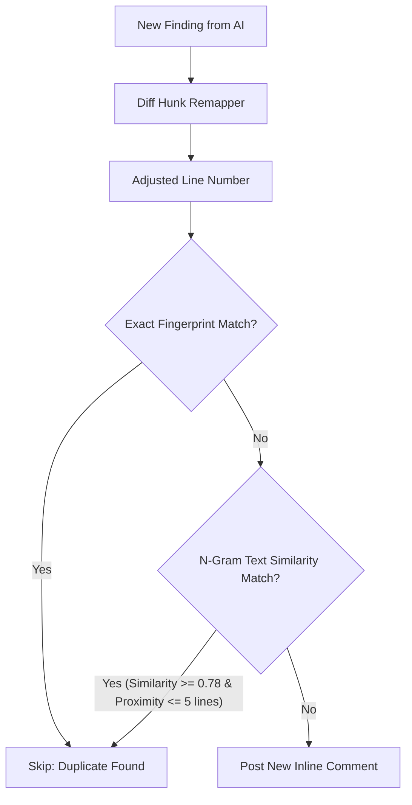

# Hybrid Zero-Dependency Comment Deduplication Plan

## Overview

When re-reviewing a Pull Request, code edits made prior to an existing issue cause **line shifts**, breaking exact fingerprint equality (`filename:line:category`). In addition, LLMs frequently reword findings across runs.

This plan details a **zero-dependency hybrid deduplication system** for [CommentManager](file:///root/merge-mentor/src/review/commentManager.ts) in `merge-mentor`. It combines **git hunk offset remapping** with **pure TypeScript string similarity matching**—delivering line-shift and rewording resilience without external APIs or heavy ML packages.

---

## High-Level Architecture



---

## Key Modules to Implement

### 1. Diff Hunk Line Remapper (`src/utils/hunkRemapper.ts`)

- **Purpose:** Calculate line shifts between previous and current PR revisions using git diff patch hunks (`@@ -oldStart,oldLen +newStart,newLen @@`).
- **Logic:**
  - Parse diff hunks to build an offset map for each file: $\Delta(L) = \sum (\text{added} - \text{deleted})$.
  - Provide a function `remapLineNumber(originalLine: number, patch: string): number` that converts an old comment's line number to its shifted position in the current diff.

### 2. Pure TypeScript Text Similarity Utility (`src/utils/textSimilarity.ts`)

- **Purpose:** Measure string similarity between finding messages without external dependencies.
- **Logic:**
  - Implement **Sørensen–Dice Coefficient** on bigrams/trigrams after normalizing text (lowercasing, stripping punctuation/code formatting).
  - Formula:
    $$S = \frac{2 |X \cap Y|}{|X| + |Y|}$$
  - Provide `calculateTextSimilarity(textA: string, textB: string): number` returning a score between $0.0$ and $1.0$.

### 3. Enhanced Comment Manager Matching (`src/review/commentManager.ts`)

- **Purpose:** Upgrade `CommentManager.findMatchingComment` to use two-stage matching:
  - **Stage 1 (Remapped Fingerprint):** Apply `remapLineNumber` to existing comments before checking `<!-- finding-id: base64(filename:line:category) -->`.
  - **Stage 2 (Proximity + Text Similarity):** If exact ID match fails, search existing comments on the same file within a line window ($\pm 5$ lines). If `category` matches and `calculateTextSimilarity` $\ge 0.78$, mark as a match.

---

## Detailed Step-by-Step Plan

| Step       | Action                                                   | Files Modified / Created                                            |
| :--------- | :------------------------------------------------------- | :------------------------------------------------------------------ |
| **Step 1** | Create string similarity utility & unit tests            | `src/utils/textSimilarity.ts`<br>`src/utils/textSimilarity.spec.ts` |
| **Step 2** | Create diff hunk line remapper & unit tests              | `src/utils/hunkRemapper.ts`<br>`src/utils/hunkRemapper.spec.ts`     |
| **Step 3** | Integrate remapping & similarity into `CommentManager`   | `src/review/commentManager.ts`                                      |
| **Step 4** | Add unit tests for line-shifted & reworded deduplication | `src/review/commentManager.spec.ts`                                 |
| **Step 5** | Validate full test suite and TypeScript types            | `pnpm check`                                                        |

---

## Proposed Component Implementations

### Utility: `src/utils/textSimilarity.ts`

```typescript
/**
 * Calculates string similarity using the Sørensen-Dice coefficient on bigrams.
 * Returns a similarity score between 0.0 (completely different) and 1.0 (identical).
 */
export function calculateTextSimilarity(str1: string, str2: string): number {
  const norm1 = str1
    .toLowerCase()
    .replace(/[^\w\s]/g, "")
    .trim();
  const norm2 = str2
    .toLowerCase()
    .replace(/[^\w\s]/g, "")
    .trim();

  if (norm1 === norm2) return 1.0;
  if (norm1.length < 2 || norm2.length < 2) return 0.0;

  const getBigrams = (str: string): Set<string> => {
    const bigrams = new Set<string>();
    for (let i = 0; i < str.length - 1; i++) {
      bigrams.add(str.slice(i, i + 2));
    }
    return bigrams;
  };

  const bg1 = getBigrams(norm1);
  const bg2 = getBigrams(norm2);

  let intersection = 0;
  for (const bg of bg1) {
    if (bg2.has(bg)) intersection++;
  }

  return (2 * intersection) / (bg1.size + bg2.size);
}
```

### Utility: `src/utils/hunkRemapper.ts`

```typescript
/**
 * Adjusts a line number from a previous diff to account for additions/deletions in a new patch.
 */
export function remapLineNumber(
  originalLine: number,
  patch: string | undefined,
): number {
  if (!patch || originalLine <= 0) return originalLine;

  const lines = patch.split("\n");
  let currentOldLine = 0;
  let currentNewLine = 0;

  for (const line of lines) {
    const hunkMatch = line.match(/^@@ -(\d+),(?:\d+)? \+(\d+),(?:\d+)? @@/);
    if (hunkMatch) {
      currentOldLine = Number.parseInt(hunkMatch[1], 10);
      currentNewLine = Number.parseInt(hunkMatch[2], 10);
      continue;
    }

    if (currentOldLine === 0) continue;

    if (currentOldLine >= originalLine) {
      const offset = currentNewLine - currentOldLine;
      return originalLine + offset;
    }

    if (line.startsWith("+")) {
      currentNewLine++;
    } else if (line.startsWith("-")) {
      currentOldLine++;
    } else if (line.startsWith(" ")) {
      currentOldLine++;
      currentNewLine++;
    }
  }

  return originalLine;
}
```

---

## Quality & Compliance Verification

To comply with workspace rules:

- All internal imports must include explicit `.js` extensions (`import { calculateTextSimilarity } from "../utils/textSimilarity.js"`).
- Strict TypeScript with zero `any` or `!` non-null assertions.
- Unit tests (`*.spec.ts`) placed in the same directory as source files.
- Full validation executed via `pnpm check`.
